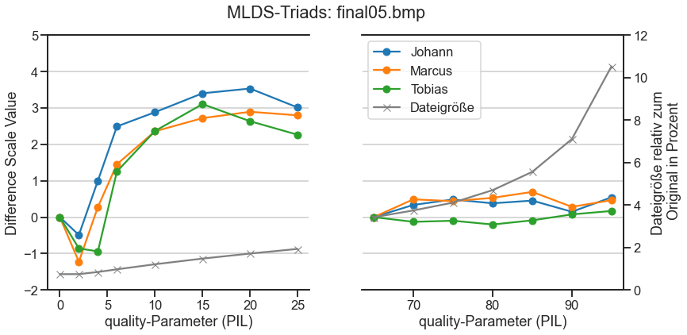
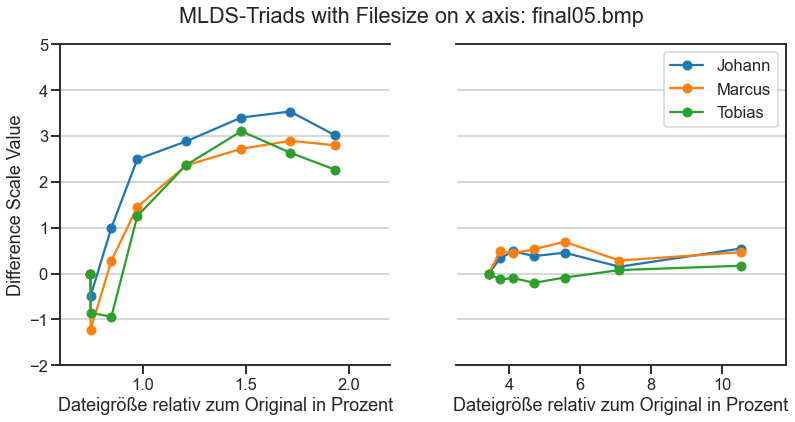

# Zusammenhang zwischen wahrgenommener Bildqualität nach Bildkompression und Dateigröße bewertet mit Maximum Likelihood Difference Scaling (MLDS)

## Marcus Bindermann, Johann Pönitz, Tobias Urban

### Seminar: Visuelle Wahrnehmung beim Menschen und Bildqualität – WiSe 2020/21


```python
import numpy as np
import os
import matplotlib.pyplot as plt
from PIL import Image
import matplotlib.gridspec as gridspec
import seaborn as sns
sns.set_style('ticks')
sns.set_context('talk')
```

## 1. Einleitung

Bilder werden für die Übertragung im Internet häufig komprimiert, um die Dateigröße zu verringern und damit die zu übertragende Datenmenge zu reduzieren. Eines der verbreitetsten Dateiformate für die Bildkompression ist das JPEG-Format. Bei einer solchen Bildkompression handelt es sich um eine verlustbehaftete Bildkomprimierung, das heißt Bildinformationen gehen objektiv verloren.

Das nachfolgende Experiment untersucht, wie sich die wahrgenommene Bildqualität beim Komprimieren verändert. Diese wahrgenommene Bildqualität wird in Relation zur Dateigröße betrachtet. Um die Veränderung der wahrgenommenen Bildqualität zu untersuchen, verwenden wir die MLDS-Methode auf der Grundlage von Triaden-Vergleichen, wie von Charrier et al. [1] beschrieben.

Unsere Untersuchungshypothese ist, dass sich die wahrgenommene Bildqualität proportional zur Dateigröße verändert und somit mit steigender Dateigröße in gleichem oder ähnlichem Maß ansteigt.

## 2. Experimentelles Design

Als Ausgangsdaten für unsere Untersuchung verwendeten wir Bilder aus der Colourlab Image Database:Image Quality (CID:IQ) des Norwegian Colour and Visual Computing Laboratory der Norwegian University of Science and Technology [2]. Wir entschieden uns für diesen Bilddatensatz, da die Bilder für Forschungszwecke verwendet werden dürfen und im unkomprimierten BMP-Format zur Verfügung gestellt werden.


```python
print_images()
```


    

    


Für die Komprimierung der Bilder nutzten wir die Python Image Library (PIL) mit der Funktion save(), die beim Aufruf als Argumente das Zielformat (JPEG) sowie einen ganzzahligen quality-Parameter zwischen 0 (größte Kompression, geringste Dateigröße) und 95 (geringste Kompression, größte Dateigröße) übergeben bekommt. Von der Verwendung von quality-Parametern größer als 95 wird in der PIL-Dokumentation abgeraten, weshalb wir diese Werte nicht weiter betrachten.

Für quality-Parameter von 0 bis 2 ändert sich die Dateigröße fast gar nicht. Im Bereich der quality-Parameter von 3 bis etwa 60 folgt die Veränderung der Dateigröße in etwa dem Verlauf eines Graphen einer linearen Funktion. Oberhalb des quality-Paramters von 60 steigt die Kurve, die die Dateigröße darstellt, steil an und folgt in ihrer Form dem Verlauf einer quadratischen Funktion. Wir gehen aufgrund unserer Hypothese also davon aus, dass die wahrgenommene Bildqualität in etwa dem Kurvenverlauf des Wachstums der Dateigröße mit steigendem quality-Paramter erhöht.


```python
for element in filenumbers_all:
    createImages(element,0,95,1)
    getFilesize(element,0,95,1,filesize_absolute_all,filesize_relative_all)
    deleteImages(element,0,95,1)
```


```python
plotQualitySizeRatioAll()
```


    

    


Anders als etwa bei der Bildkomprimierung mittels Vektor-Quantifizierung wie in [1], können wir mit der save()-Methode der Python Image Library die gewünschte Dateigröße des komprimierten Bildes nicht manuell bestimmen. Um die Veränderung der wahrgenommenen Bildqualität zwischen den einzelnen Stimuli zu ermöglichen, wählen wir aus dem Datensatz insgesamt fünf Bilder mit einem ähnlichen Verhältnis zwischen steigendem quality-Parameter und Dateigröße aus.


```python
plotQualitySizeRatioAllFocused()
```


    

    


Anders als etwa bei der Bildkomprimierung mittels Vektor-Quantifizierung wie in [1], können wir mit der save()-Methode der Python Image Library die gewünschte Dateigröße des komprimierten Bildes nicht manuell bestimmen. Um die Veränderung der wahrgenommenen Bildqualität zwischen den einzelnen Stimuli zu ermöglichen, wählen wir aus dem Datensatz insgesamt fünf Bilder mit einem ähnlichen Verhältnis zwischen steigendem quality-Parameter und Dateigröße aus.

Da die Versuchspersonen die Stimuli vollständig und in 100-Prozent-Auflösung auf ihrem Bildschirm darstellen können sollten, verringerten wir die Bildgröße der Originalbilder von 800 x 800 Pixel auf 500 x 500 Pixel mittels der Python-Funktion resize(), die als Argument ein Paar bestehend aus der gewünschten Bildhöhe und Bildbreite in Pixel übergeben bekommt. Diese Ausgangsbilder für die folgenden Experimente speicherten wir wieder im BMP-Format ab, sodass bei dieser Größenanpassung noch keine Bildkompression stattfand.


```python
# create array with filesize in it
filenumbers = ['05', '09', '18', '20', '23']
parameter = [0,2,4,6,10,15,20,25,65,70,75,80,85,90,95]
```


```python
# resize images to 500 x 500 px

for element in filenumbers:
    pic = Image.open('images/originals/final{}.bmp'.format(element))
    size = (500, 500)
    out = pic.resize(size)
    out.save('images/final{}.bmp'.format(element), 'bmp')
```


```python
createStimuli(filenumbers, parameter)
```


```python
# original image size in 500 x 500 px = 750.054 bytes

filesize_relative = []
filesize_absolute = []
for element in filenumbers:
    filesize_absolute.append([])
    filesize_relative.append([])
    for param in parameter:
        file = 'images/final{}_quality_{}.jpg'.format(element, param)
        filesize_absolute[len(filesize_absolute)-1].append(os.stat(file).st_size)
        filesize_relative[len(filesize_relative)-1].append(os.stat(file).st_size/750054*100)
```


```python
plotQualitySizeRatioStimuli()
```


    

    


Unser experimentelles Design beinhaltet Triadenvergleiche und folgt dabei dem Paper von Charrier et al. [1]. Dabei erstellen wir für jedes der fünf Ausgangsbilder insgesamt 15 Stimuli mit jeweils unterschiedlichen quality-Parametern und speichern diese im JPEG-Format ab. Bei beiden Teilexperimenten sehen die Versuchspersonen nacheinander alle möglichen Kombination aus drei Stimuli, die sich im Grad ihrer Kompression unterscheiden. Dabei lautet die Aufforderung an die Versuchspersonen durch Drücken der linken oder rechten Pfeiltaste dasjenige Bilderpaar auszuwählen, welches sich stärker unterscheidet. Die Versuchspersonen haben dabei keine Zeitbegrenzung für Ihre Wahl, werden jedoch zu einer Entscheidung gezwungen. Ein Enthalten oder Nicht-Abstimmen ist nicht möglich. Bei den Versuchspersonen handelte es sich um die drei Gruppenmitglieder, die die Experimente selbstständig an ihren eigenen Computern durchführten. 

Im ersten Teil des Experimentes sehen die Versuchspersonen am Computerbildschirm nacheinander alle möglichen Kombinationen aus drei Stimuli, die mit den 8 verschiedenen quality-Parametern 0, 2, 4, 6, 10, 15, 20, 25 komprimiert wurden. Der Binomialkoeffizient von 8 und 3 ist 56, für jedes Bild sehen die Versuchspersonen also 56 verschiedene Triaden. Im zweiten Teil des Experiments ist die Aufgabenstellung für die Versuchspersonen gleich. Es werden sieben Stimuli erzeugt, also Bilder die mit den quality-Parametern 65, 70, 75, 80, 85, 90, 95 komprimiert wurden. Die Versuchspersonen sehen nacheinander alle möglichen Kombinationen von 3 Stimuli aus 7, also insgesamt 35 verschiedene.

Für jedes der fünf Bilder wurden für beide Teilexperimente (vorderer und hinterer Skalenbereich) jeweils vier Versuche durchgeführt. Der erste Versuch diente dazu, dass sich die Versuchsperson mit den Stimuli und dem Experimentdesign vertraut machen. Die Ergebnisse des ersten Versuchs wurden verworfen und nicht ausgewertet. Die Ergebnisse der folgenden drei Versuche wurden in einer CSV-Datei gespeichert und mithilfe eines R-Skriptes die von den Versuchspersonen Veränderung der wahrgenommenen Bildqualität (Difference Scale Value) berechnet.

Jede der drei getesteten Personen führten insgesamt also für jedes Bild im ersten Teilexperiment 56 und im zweiten Teilexperiment 35 Vergleiche je Versuch durch. Jeder Versuch wurde vier Mal wiederholt, sodass pro Bild 364 Vergleiche nötig waren, die Summe für alle fünf Bilder beträgt 1820 Vergleiche.

## 3. Ergebnisse


```python
plot_mlds('05')
plot_mlds_filesize('05')
print_stimuli(5, front_parameter)
print_stimuli(5, back_parameter)
```


    

    


    

    


    

    


    

    


```python
plot_mlds('09')
plot_mlds_filesize('09')
print_stimuli(9, front_parameter)
print_stimuli(9, back_parameter)
```


    

    


    

    


    

    


    

    


```python
plot_mlds('18')
plot_mlds_filesize('18')
print_stimuli(18, front_parameter)
print_stimuli(18, back_parameter)
```


    

    


    

    


    

    


    

    


```python
plot_mlds('20')
plot_mlds_filesize('20')
print_stimuli(20, front_parameter)
print_stimuli(20, back_parameter)
```


    

    


    

    


    

    


    

    


```python
plot_mlds('23')
plot_mlds_filesize('23')
print_stimuli(23, front_parameter)
print_stimuli(23, back_parameter)
```


    

    


    

    


    

    


    

    


## Referenzen

[1] Christophe Charrier et al., "Maximum likelihood difference scaling of image quality in compression-degraded images", *Journal of the Optical Society of America A*, Vol. 24, Issue 11, 2007. https://doi.org/10.1364/JOSAA.24.003418

[2] https://www.ntnu.edu/web/colourlab/software

[2] https://pillow.readthedocs.io/en/stable/handbook/image-file-formats.html#jpeg

## Rohdaten aus MLDS-Experimenten, aufbereitet in R


```python
# data from mlds triads after processing in r

result_jp_05 = [0.00, -0.49, 1.00, 2.49, 2.88, 3.40, 3.53, 3.01]
result_mb_05 = [0.000, -1.224, 0.279, 1.452, 2.356, 2.718, 2.892, 2.795]
result_tu_05 = [0.000, -0.859, -0.940, 1.252, 2.365, 3.102, 2.633, 2.262]
result_jp_09 = [0.000, -0.955, 0.274, 0.768, 1.538, 1.770, 1.840, 1.793]
result_mb_09 = [0.000, -0.436, 0.333, 1.408, 3.072, 4.712, 4.775, 3.935]
result_tu_09 = [0.00, -1.30, -1.14, 1.09, 1.81, 2.54, 2.51, 2.23]
result_jp_18 = [0.000, -0.686, 0.278, 1.454, 2.113, 2.733, 2.378, 2.404]
result_mb_18 = [0.0000, -0.0379, 0.6557, 1.4550, 2.5238, 2.8409, 2.8951, 2.6796] 
result_tu_18 = [0.0000, 0.0203, 1.3997, 2.0174, 3.4570, 4.0550, 3.8830, 3.3006]
result_jp_20 = [0.000, -0.978, 0.398, 2.097, 2.363, 2.564, 2.614, 2.574]
result_mb_20 = [0.000, 0.395, 1.567, 2.406, 3.840, 4.508, 4.343, 4.022]
result_tu_20 = [0.000, -0.262, 1.593, 2.648, 3.579, 3.966, 3.922, 3.122]
result_jp_23 = [0.000, -0.558, 0.441, 1.725, 2.914, 3.016, 3.001, 2.858]
result_mb_23 = [0.000, -0.149, 0.681, 2.063, 3.328, 3.763, 3.905, 3.364]
result_tu_23 = [0.000, -0.470, 0.425, 1.312, 2.441, 2.784, 2.878, 2.273]

result_jp_05_back = [0.000, 0.335, 0.485, 0.380, 0.454, 0.148, 0.545]
result_mb_05_back = [0.000, 0.489, 0.438, 0.530, 0.693, 0.283, 0.465]
result_tu_05_back = [0.0000, -0.1286, -0.0986, -0.2021, -0.0880, 0.0749, 0.1694]
result_jp_09_back = [0.0000, -0.2463,  0.2047,  0.2402, -0.0247,  0.3465,  0.3064]
result_mb_09_back = [0.000, 0.489, 0.438, 0.530, 0.693, 0.283, 0.465]
result_tu_09_back = [0.0000, -0.1286, -0.0986, -0.2021, -0.0880, 0.0749, 0.1694]
result_jp_18_back = [0.0000, 0.0862, -0.1193, -0.3021, 0.1360, -0.0898, -0.0692]
result_mb_18_back = [0.000, -0.222, -0.191, -0.154, -0.234, -0.488, -0.602]
result_tu_18_back = [0.00000, 0.18686, -0.00947, -0.02328, -0.08471, -0.00807, -0.10590]
result_jp_20_back = [0.0000, -0.0989, 0.3431, 0.0277, 0.2378, 0.2425, 0.3471]
result_mb_20_back = [0.000, 0.110, 0.298, 0.446, 0.579, 0.446, 0.663]
result_tu_20_back = [0.000, 0.299, 0.236, 0.662, 0.443, 0.546, 1.054]
result_jp_23_back = [0.000, -0.522, -0.486, -0.584, -0.665, -0.685, -0.910]
result_mb_23_back = [0.0000, -0.0678, -0.0228, -0.1575, 0.0518, 0.1232, 0.0991]
result_tu_23_back = [0.00000, -0.07468, 0.03101, -0.00906, -0.01701, -0.16356, -0.13558]

# merged in one array per observer for easier processing

mlds_jp = [[result_jp_05, result_jp_05_back],
           [result_jp_09, result_jp_09_back],
           [result_jp_18, result_jp_18_back],
           [result_jp_20, result_jp_20_back],
           [result_jp_23, result_jp_23_back]]

mlds_mb = [[result_mb_05, result_mb_05_back],
           [result_mb_09, result_mb_09_back],
           [result_mb_18, result_mb_18_back],
           [result_mb_20, result_mb_20_back],
           [result_mb_23, result_mb_23_back]]

mlds_tu = [[result_tu_05, result_tu_05_back],
           [result_tu_09, result_tu_09_back],
           [result_tu_18, result_tu_18_back],
           [result_tu_20, result_tu_20_back],
           [result_tu_23, result_tu_23_back]]
```

## Skripte und Hilfsvariablen


```python
# compress all 23 images with parameter from 0 to 95 and save filesize in an array
# print filesize with absolute and relative parameter

filenumbers_all = ['01', '02', '03', '04', '05', '06', '07', '08', '09', '10', '11', '12', '13', '14', '15', '16', '17', '18', '19', '20', '21', '22', '23']
filesize_absolute_all = []
filesize_relative_all = []

# create an array with compression-parameter in it
compression_rate = []
for i in range(0, 96, 1):
    compression_rate.append(i)

front_parameter = [0,2,4,6,10,15,20,25]
back_parameter = [65,70,75,80,85,90,95]
filenumbers = ['05', '09', '18', '20', '23']
```


```python
def print_images():
    fig = plt.figure(figsize=(16,22))
    plt.suptitle('Ausgangsdaten: 23 Bilder im BMP-Format', y=.92)
    for i in range(1,24):
        if i < 10:
            number = '0' + str(i)
        else:
            number = str(i)
        img = Image.open('images/originals/final{}.bmp'.format(number))
        fig.add_subplot(6, 4, i)
        plt.title('final{}.bmp'.format(number))
        plt.xticks([]) 
        plt.yticks([])   
        plt.imshow(img)
```


```python
def createImages(filenumber, qual_start, qual_end, qual_steps):
    pic = Image.open('images/originals/final{}.bmp'.format(filenumber))
    picAsArray = np.array(pic)
    for i in range (qual_start, qual_end + 1, qual_steps):
        Image.fromarray(picAsArray).save('images/final{}_quality_{}.jpg'.format(filenumber, i), 'jpeg', quality=i)

def getFilesize(filenumber, qual_start, qual_end, qual_steps, sizearray_absolute, sizearray_relative):
    sizearray_absolute.append([])
    sizearray_relative.append([])
    for i in range (qual_start, qual_end + 1, qual_steps):
        file = 'images/final{}_quality_{}.jpg'.format(filenumber, i)
        sizearray_absolute[len(sizearray_absolute)-1].append(os.stat(file).st_size)
        sizearray_relative[len(sizearray_relative)-1].append(os.stat(file).st_size/1920054*100)

def deleteImages(filenumber, qual_start, qual_end, qual_steps):
    for i in range (qual_start, qual_end + 1, qual_steps):
        if os.path.exists('images/final{}_quality_{}.jpg'.format(filenumber, i)):
            os.remove('images/final{}_quality_{}.jpg'.format(filenumber, i))
```


```python
def plotQualitySizeRatioAll():    
    fig, ax1 = plt.subplots(figsize=[10,10])
    ax1.set_ylabel('Dateigröße in Bytes')
    ax1.set_xlabel('quality-Parameter (PIL)')

    for i in range (0, len(filenumbers_all)):
        ax1.plot(compression_rate, filesize_absolute_all[i],label='final{}.bmp'.format(filenumbers_all[i]))
    ax1.tick_params(axis='y')
    ax1.legend(bbox_to_anchor=(1.5, 1))

    ax2 = ax1.twinx()  

    ax2.set_ylabel('Dateigröße relativ zum Original in Prozent')
    for i in range (0, len(filenumbers_all)):#len(filesize_absolute)):
        ax2.plot(compression_rate, filesize_relative_all[i])

    plt.title('Verhältnis zwischen quality-Parameter und Dateigröße')
    ax2.grid(True)
    plt.show()
    #plt.savefig('compression_size_ratio_v2_500px_compressed_65--95.svg', bbox_inches='tight')
```


```python
def plotQualitySizeRatioAllFocused():        
    fig, ax1 = plt.subplots(figsize=[10,10])
    ax1.set_ylabel('Dateigröße in Bytes')
    ax1.set_xlabel('quality-Parameter (PIL)')

    for i in range (0, len(filenumbers_all)):
        if filenumbers_all[i] in filenumbers:
            ax1.plot(compression_rate, filesize_absolute_all[i],label='final{}.bmp'.format(filenumbers_all[i]))
        else:
            ax1.plot(compression_rate, filesize_absolute_all[i],label='final{}.bmp'.format(filenumbers_all[i]), color='grey',linewidth=.5)
    ax1.tick_params(axis='y')
    ax1.legend(bbox_to_anchor=(1.5, 1))

    ax2 = ax1.twinx()  

    ax2.set_ylabel('Dateigröße relativ zum Original in Prozent')
    for i in range (0, len(filenumbers_all)):
        if filenumbers_all[i] in filenumbers:
            ax2.plot(compression_rate, filesize_relative_all[i])
        else:
            ax2.plot(compression_rate, filesize_relative_all[i],color='grey',linewidth=.5)

    plt.title('Verhältnis zwischen quality-Parameter und Dateigröße')
    ax2.grid(True)

    plt.show()
    #plt.savefig('compression_size_ratio_v2_500px_compressed_65--95.svg', bbox_inches='tight')
```


```python
def createStimuli(filenumbers, parameter):
    for element in filenumbers:
        pic = Image.open('images/final{}.bmp'.format(element))
        picAsArray = np.array(pic)
        for param in parameter:
            Image.fromarray(picAsArray).save('images/final{}_quality_{}.jpg'.format(element, param), 'jpeg', quality=param)
```


```python
def plotQualitySizeRatioStimuli():    
    plt_colors = ['tab:blue', 'tab:orange', 'tab:green', 'tab:red', 'tab:purple']

    fig, ax1 = plt.subplots(figsize=[10,10])
    ax1.set_ylabel('Dateigröße in Bytes')
    ax1.set_xlabel('quality-Parameter (PIL)')

    for i in range (0, len(filenumbers)):
        ax1.plot(parameter[:8], filesize_absolute[i][:8],marker='o',label='final{}.bmp'.format(filenumbers[i]),color=plt_colors[i])
        ax1.plot(parameter[8:], filesize_absolute[i][8:],marker='o',color=plt_colors[i])
    ax1.tick_params(axis='y')
    ax1.legend(bbox_to_anchor=(1.5, 1))

    ax2 = ax1.twinx()  

    ax2.set_ylabel('Dateigröße relativ zum Original in Prozent')
    for i in range (0, len(filenumbers)):
        ax2.plot(parameter[:8], filesize_relative[i][:8],marker='o',label='final{}.bmp'.format(filenumbers[i]),color=plt_colors[i])
        ax2.plot(parameter[8:], filesize_relative[i][8:],marker='o',color=plt_colors[i])

    plt.title('Verhältnis zwischen quality-Parameter und Dateigröße')
    ax2.grid(True)

    plt.show()
    #plt.savefig('compression_size_ratio_v2_500px_compressed_65--95.svg', bbox_inches='tight')
```


```python
def plot_mlds(filenumber):
    fig=plt.figure(figsize=(13,13))
    fig.suptitle('MLDS-Triads: final{}.bmp'.format(filenumber), y=0.92)
    ax1 = plt.subplot(221)
    ax2 = plt.subplot(222)
    ax3 = ax1.twinx()
    ax4 = ax2.twinx()
    ax1.set_ylabel('Difference Scale Value')
    ax1.set_xlabel('quality-Parameter (PIL)')
    ax2.set_xlabel('quality-Parameter (PIL)')
    ax2.set_yticklabels([])
    ax3.set_yticklabels([])
    ax4.set_ylabel('Dateigröße relativ zum\n Original in Prozent')
    p1, = ax1.plot(front_parameter, mlds_jp[filenumbers.index(filenumber)][0], marker='o', label="Johann")
    p2, = ax1.plot(front_parameter, mlds_mb[filenumbers.index(filenumber)][0], marker='o', label="Marcus")
    p3, = ax1.plot(front_parameter, mlds_tu[filenumbers.index(filenumber)][0], marker='o', label="Tobias")
    p4, = ax3.plot(front_parameter, filesize_relative[filenumbers.index(filenumber)][0:8], marker='x', label="Dateigröße", color="grey")
    ax1.grid(axis='y')
    ax1.set_ylim([-2,5])
    ax3.set_ylim([0,12])
    ax2.plot(back_parameter, mlds_jp[filenumbers.index(filenumber)][1], marker='o', label="Johann")
    ax2.plot(back_parameter, mlds_mb[filenumbers.index(filenumber)][1], marker='o', label="Marcus")
    ax2.plot(back_parameter, mlds_tu[filenumbers.index(filenumber)][1], marker='o', label="Tobias")
    ax4.plot(back_parameter, filesize_relative[filenumbers.index(filenumber)][8:], marker='x', label="Dateigröße", color="grey")
    ax2.grid(axis='y')
    ax2.set_ylim([-2,5])
    ax4.set_ylim([0,12])
    lines = [p1, p2, p3, p4]
    plt.legend(lines, [l.get_label() for l in lines])
    plt.show()    
```


```python
def plot_mlds_filesize(filenumber):
    fig=plt.figure(figsize=(13,13))
    fig.suptitle('MLDS-Triads with Filesize on x axis: final{}.bmp'.format(filenumber), y=0.92)
    ax1 = plt.subplot(221)
    ax2 = plt.subplot(222)
    ax1.set_ylabel('Difference Scale Value')
    ax1.set_xlabel('Dateigröße relativ zum Original in Prozent')
    ax2.set_xlabel('Dateigröße relativ zum Original in Prozent')
    ax2.set_yticklabels([])
    p1, = ax1.plot(filesize_relative[filenumbers.index(filenumber)][0:8], mlds_jp[filenumbers.index(filenumber)][0], marker='o', label="Johann")
    p2, = ax1.plot(filesize_relative[filenumbers.index(filenumber)][0:8], mlds_mb[filenumbers.index(filenumber)][0], marker='o', label="Marcus")
    p3, = ax1.plot(filesize_relative[filenumbers.index(filenumber)][0:8], mlds_tu[filenumbers.index(filenumber)][0], marker='o', label="Tobias")
    ax1.grid(axis='y')
    ax1.set_xlim([.6,2.2])
    ax2.set_xlim([2.5,11.8])
    ax2.plot(filesize_relative[filenumbers.index(filenumber)][8:], mlds_jp[filenumbers.index(filenumber)][1], marker='o', label="Johann")
    ax2.plot(filesize_relative[filenumbers.index(filenumber)][8:], mlds_mb[filenumbers.index(filenumber)][1], marker='o', label="Marcus")
    ax2.plot(filesize_relative[filenumbers.index(filenumber)][8:], mlds_tu[filenumbers.index(filenumber)][1], marker='o', label="Tobias")
    ax2.grid(axis='y')
    ax1.set_ylim([-2,5])
    ax2.set_ylim([-2,5])
    lines = [p1, p2, p3]
    plt.legend(lines, [l.get_label() for l in lines])
    plt.show()    
```


```python
def print_stimuli(number, parameter):
    if number < 10:
        number = '0' + str(number)
    fig = plt.figure(figsize=(15,7))
    if parameter[0] == 0:
        plt.suptitle('Stimuli: final{}'.format(number), y=0.99)
    else: 
        plt.suptitle('\n')
    for i in range(0,len(parameter)):
        img = Image.open('images/final{}_quality_{}.jpg'.format(number, parameter[i]))
        fig.add_subplot(2, 4, i + 1)
        plt.title('quality = {}'.format(parameter[i]))
        plt.xticks([]) 
        plt.yticks([])   
        plt.imshow(img)
```
